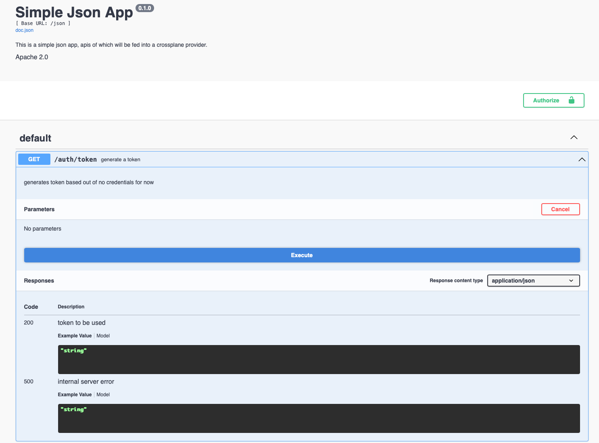
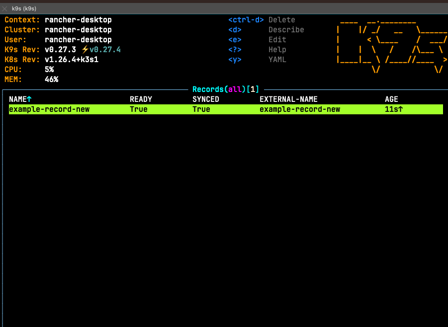
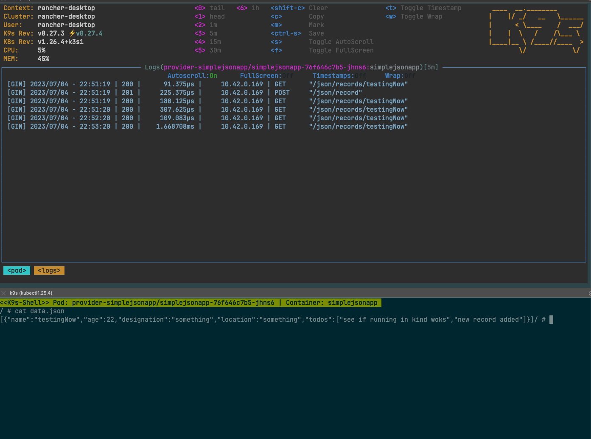
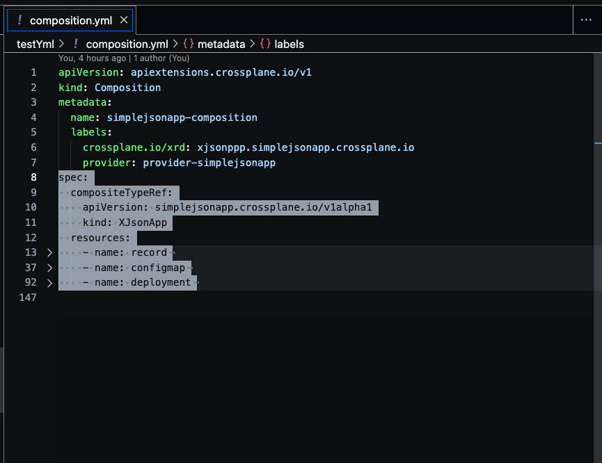
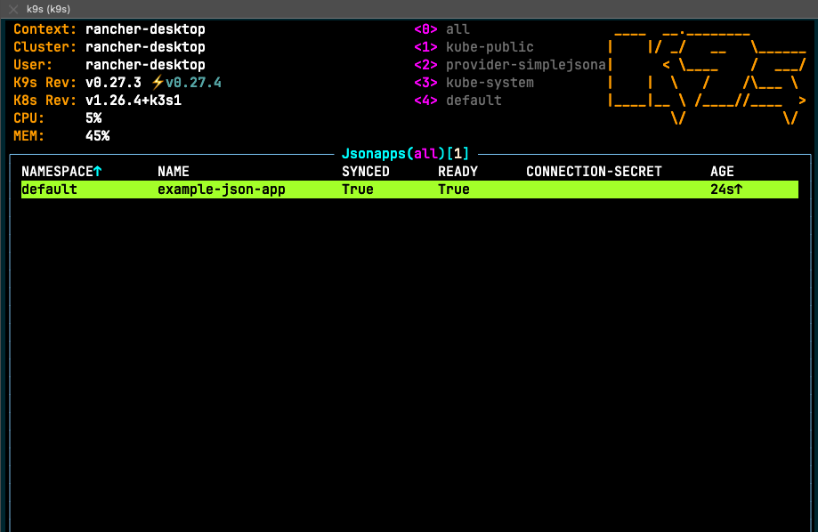
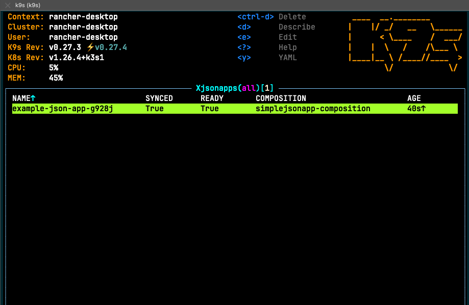
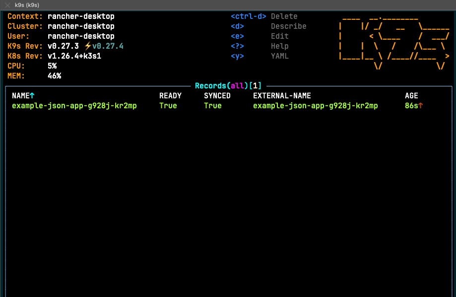
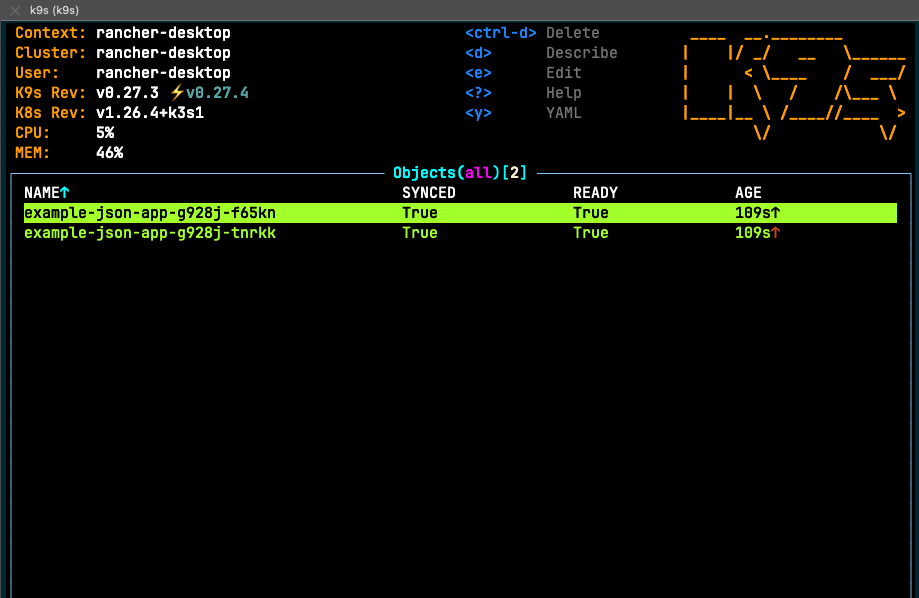
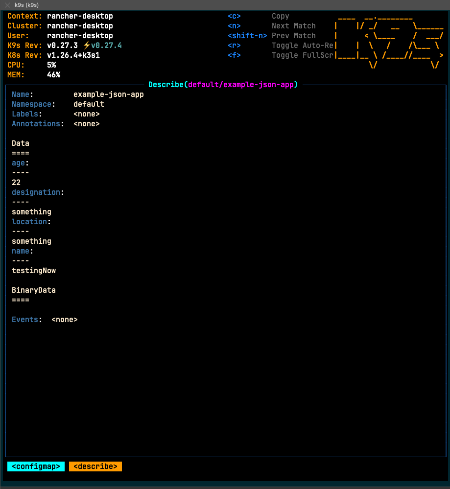
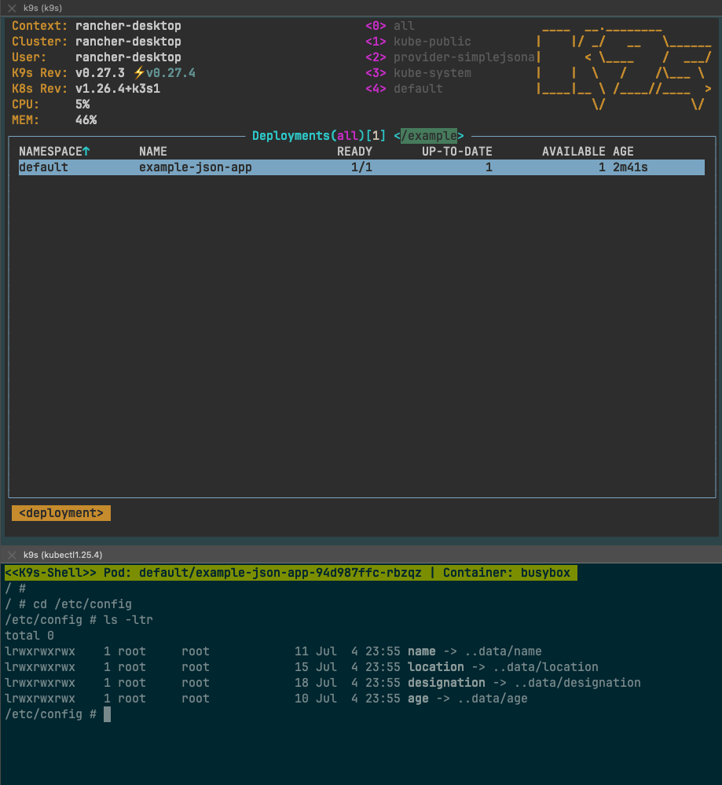

# provider-simplejsonapp

## Introduction

[simple json app](https://gitlab.com/heb-engineering/teams/platform-engineering/gke-hybrid-cloud/kon/crossplane/simplejsonapp/simplejsonapp) is a simple api server which exposes some api endpoints and will act as the external resource for which we'll build a Custom Crossplane provider `provider-simplejsonapp`.

`provider-simplejsonapp` is a minimal [Crossplane](https://crossplane.io/) Provider using which one can express external json records as a k8s `record` resource. Once the provider is installed, we will be able to manage records in the api server using a Managed Reosurce available to us from the k8s api called `Record`.

Once that is done, we will devleop `Composition`, `XRD` and `Claim` to expose a record object as a ConfigMap k8s resource and build a deployment to use it, thereby showing how we can build Composites of Managed Resources from more than one provider.

## Install Crossplane

Please follow below steps in your local cluster to install `Crossplane.` Once done, you should see a new namespace called `crossplane-system` with `Crossplane` installed within it.

```
$ helm repo add crossplane-stable https://charts.crossplane.io/stable
$ helm repo update
$ helm install crossplane \
--namespace crossplane-system \
--create-namespace crossplane-stable/crossplane
```

## Deploy and setup api server for our provider

`Note: We will deploy an instance of the simple json app within our local cluster. The provider is hard-coded to use the service that this deployment is exposed by to create and manage record resources.
  In actual practice, this will be an external system, like a resource in`GCP`or a external RESTful API, but we choose to setup this app within the same cluster for demonstration purposes.`

- [simple json app](https://gitlab.com/heb-engineering/teams/platform-engineering/gke-hybrid-cloud/kon/crossplane/simplejsonapp/simplejsonapp) can be installed using this yaml:

  ```
  $ kubectl apply -f testYml/simplejsonapp.yml
  ```

  which installs simple json app api server as a deployment and exposes it with a k8s service resource.

- Get auth token from running app:

  Port-forward into the app and get the auth token from its Swagger UI.

  ```
  $ kc port-forward <simplejsonapp-pod> -n provider-simplejsonapp 8081:8081
  ```

  Now navigate to app's Swagger UI [here](http://localhost:8081/swagger/index.html) and execute request /auth/token to get your token

  

- Create a secret with simple json app's jwt token like so:

  ```
  $ kubectl create secret generic simplejsonapp-secret --from-literal=token=<jwt token from simple json app's swagger ui here> -n crossplane-system
  ```

## Provider-simplejsonapp installation

- Install Simple json app CRDs for Record Managed Resource and other ProviderConfig CRDs:

  ```
  $ kubectl apply -f package/crds
  ```

- Next, with your kube context pointing to cluster, or where ever you wish to install Crossplane and the provider, run:

  ```
  $ kubectl apply -f testYml/provider-simplejsonapp.yml
  ```

  which installs Provider as a pod and sets up necessary permissions for it to be able to manage k8s resources and ProviderConfig `provider-simplejsonapp-config` (which references the secret we created in the previous step)

## Provider-kubernetes installation

- We want to setup a secret containing cluster's kubeconfig for use by the provider. Assuming you have kubeconfig in a file called `./kubeconfig.yml`,
  the below command should setup a secret in `crossplane-system` namespace that `ProviderConfig kubernetes-provider` installed as part of next step, will use to setup config to use by the provider.

  ```
  $ kubectl create secret generic rancher-desktop-kubeconfig --from-file=kubeconfig=./kubeconfig.yml -n crossplane-system
  ```

  Other ways to setup config may exist, but this method to setup config was used in this case.

- Install provider-kubernetes using below command:

  ```
  $ kubectl apply -f testYml/provider-kubernetes.yml
  ```

  which installs the Provider and its associated ProviderConfig (used by Object Managed Resources later for kubeconfig)

## Record Managed Resource from provider-simplejsonapp in action

We have a Managed Resource called "Record" that's provided to us by `provider-simplejsonapp`. Below section shows that you can using the Managed Resource `Record` create and manage those record objects:

Below command to create a Record Managed Resource:

```
$ kubectl apply -f testYml/record.yml
```

This creates a Managed Resource called record with properties as shown below in spec.forProvider:

```
---
apiVersion: records.simplejsonapp.crossplane.io/v1alpha1
kind: Record
metadata:
  name: example-record-new
  namespace: default
spec:
  providerConfigRef:
    name: provider-simplejsonapp-config
  forProvider:
    name: testingNow
    age: 22
    location: something
    designation: something
    todos:
      - see if running in kind woks
      - new record added
```

When this yaml is applied, it creates a Managed Resource and makes an api call to create the json record in the `simplejsonapp` deployed in `provider-simplejsonapp` namespace. It uses ProviderConfig `provider-simplejsonapp-config` as referenced by spec.providerConfigRef in the yaml, which contains the auth token used to auth and make calls against the simplejsonapp api server. Below are images showing successful creation of the record within the api server.

### Record created:



Below image showing simplejsonapp api service logging a post call to create the resource, and a json item added to it's local storage in data.json file:



`provider-simplejsonapp` provides us this functionality and allows us to take any external system that has a defined RESTful API and creates a k8s `Managed Resource` (in our case called `Record`) to manage external resources using it.

Now with Crossplane `Compositions`, `XR` and `XRD` we can go one step further and make `Compositions` of multiple resources and create `Claims` to provide to platform consumers to deploy their namespaced resources.

## Defining Compositions, Composite Resources, Composite Resource Definitions and Claims:

We will be setting up a `Composition` and a `Composite Resource Definition(XRD)` to setup a composite set of managed resources. This will be made available to platform consumers as a `Composite Resource Claim(or simply Claim)` created from a `XRD`. A `Claim` when applied against the k8s api creates a `Composite Reosource (XR)`, the resources to be created when a `XR` is created come from the definition of its `Composition`.

So essentially, we create the blueprint for all the resources that compose up to make a `Composite Resource(XR)` using a `Composition` and define a `XRD` which creates a `Claim`, which can be used at a namespaced level, to create `XR` corresponding to a consumer's Claim.

More details on the relationship of the resources and other terminology [here](https://docs.crossplane.io/latest/concepts/terminology/)

## Composition

```
$ kubectl apply -f testYml/composition.yml
```

Please refer to the yaml in question. `Composition` creates the blueprint for the `Composite Resources(XR)` when one creates it using a `Claim`. The `XR` kind it creates is defined by `spec.compositeTypeRef` object in it's definition. In our case, it is `XJsonApp` kind from `simplejsonapp.crossplane.io/v1alpha1` apiVersion. Note that the kind has a prefix 'X' to denote that it creates a `Composite Resource`. Claims don't have a 'X' prefix.

`spec.resources` becomes the rest of it's definition and as mentioned previously, it defines the resources that this `Composition` is made up of and declares the resources thatget created when `XR` is created.

You'll see three resources in this example (`spec.resources`), one for the `Record` managed resource coming from our custom `provider-simplejsonapp` provider, and two coming from `provider-kubernetes` called `Object` managed resource and manage a ConfigMap and a Deployment k8s resource.



Other things to note with the `Record` managed resource definition in the `Composition`:

- It references the same `ProviderConfig` that was used to create a single `Record` managed resource, and contains auth token to make api calls against the simple json app api server.
- Patches are used to make patches either to the `Composed Resources (Managed Resources)` by copying some attribute value from `XR` or patches made to the `Composite Reosource(XR)` by copying some attribute value from it's managed Resource(s).

  This resource object has three patches, first two apply patches to the Managed Resource, the third applies a patch to the Composite Resource so it can later pass record details down to `ConfigMap` managed resource.

  First two update Record Managed Resource's name and namespace with labels added to the XR based on the Claim it gets created from, and the third sets `status.record` on the XR from record's `spec.froProvider`.

  ```
  patches:
    - type: FromCompositeFieldPath
      fromFieldPath: metadata.labels[crossplane.io/claim-namespace]
      toFieldPath: metadata.namespace
      policy:
        fromFieldPath: Required
    - type: FromCompositeFieldPath
      fromFieldPath: spec.parameters
      toFieldPath: spec.forProvider
      policy:
        fromFieldPath: Required
    - type: ToCompositeFieldPath
      fromFieldPath: spec.forProvider
      toFieldPath: status.record
      policy:
        fromFieldPath: Required
  ```

Rest two Object Managed Resources for k8s' Deployment and ConfigMap resources:

These are defined using `provider-kubernetes`'s `Object` managed resource, which is simply a Crossplane provider abstraction over an existing k8s resource and allows for a regular k8s resource to be embedded into a `Crossplane Composition` and managed as one of the managed resources within a `XR`.

Things to note in second resource, `configmap`:

- Has a dummy `data` section under `spec.forProvider.manifest`, which will be soon replaced by actual data using patches.
- Speaking of, patches from index `2` show each record attribute being picked from `XR`'s `status.record` section and pached into `data` on the ConfigMap.

  ```
  - type: FromCompositeFieldPath
    fromFieldPath: status.record.name
    toFieldPath: spec.forProvider.manifest.data.name
    policy:
      fromFieldPath: Required
  - type: FromCompositeFieldPath
    fromFieldPath: status.record.designation
    toFieldPath: spec.forProvider.manifest.data.designation
    policy:
      fromFieldPath: Required
  - type: FromCompositeFieldPath
    fromFieldPath: status.record.location
    toFieldPath: spec.forProvider.manifest.data.location
    policy:
      fromFieldPath: Required
  - type: CombineFromComposite
    combine:
      variables:
        - fromFieldPath: status.record.age
      strategy: string
      string:
        fmt: "%d"
    toFieldPath: spec.forProvider.manifest.data.age
    policy:
      fromFieldPath: Required
  ```

- Like the previous resource, patch indexes `0 & 1` patch the name and namespace of the resulting k8s ConfigMap resource.

  ```
  - type: FromCompositeFieldPath
    fromFieldPath: metadata.labels[crossplane.io/claim-name]
    toFieldPath: spec.forProvider.manifest.metadata.name
    policy:
      fromFieldPath: Required
  - type: FromCompositeFieldPath
    fromFieldPath: metadata.labels[crossplane.io/claim-namespace]
    toFieldPath: spec.forProvider.manifest.metadata.namespace
    policy:
      fromFieldPath: Required
  ```

`Note: For more details on patch types see [here.](https://docs.crossplane.io/v1.10/reference/composition/#patch-types)`

Things to note with the third resource, `deployment`:

- This deployment simply exposes the contents of the ConfigMap from previous step and shows that we can access record Managed Resource's data from within the deployment.
- As far as patches go, the only notable one appears as the second patch item patching configMap name to be used by the Deployment to refer while creating mount path in its pod.

  ```
  - type: FromCompositeFieldPath
    fromFieldPath: metadata.labels[crossplane.io/claim-name]
    toFieldPath: spec.forProvider.manifest.spec.template.spec.volumes[0].configMap.name
    policy:
      fromFieldPath: Required
  ```

To summarize, this yaml essentially declares the structure of `XRs` that get created from this `Composition`.

## Composite Resource Definition (XRD)

To apply XRD, run below:

```
$ kubectl apply -f testYml/xrd.yml
```

Please refer to the yaml in question.

This defines the schema for the `Claim` resources one can use to create `XRs`. `spec.names` defines the kind of `XRs` that get created when one uses this `XRD` to create a claim with. `spec.claimNames` defines the claim kind that will be created by Crossplane once this yaml is applied.

```
spec:
  group: simplejsonapp.crossplane.io
  names:
    kind: XJsonApp
    plural: xjsonapps
  claimNames:
    kind: JsonApp
    plural: jsonapps
```

`spec.versions` list can contain more than one version of this `XRD` definition. What follows is the schema definition for `spec` that `Claims` resource can use to define `XR` and `status` to store `Record` managed resource data, in `spec.versions[0].schema.openAPIV3Schema.properties.spec` and `spec.versions[0].schema.openAPIV3Schema.properties.status.`

The properties for both spec and status in this case has been chosen to be same, so as to store record attributes in `XR`'s status and propagate them to `ConfigMap` managed resource:

```
name:
  type: string
age:
  type: integer
designation:
  type: string
location:
  type: string
todos:
  type: array
  items:
    type: string
```

When the `XRD` is applied, we see a new k8s resource called `JsonApp` being created, for more details of which see next section.

## Composite Resource Claim (or Claim)

To apply a Claim, run below command:

```
$ kubectl apply -f testYml/claim.yml
```

yaml shown below:

```
apiVersion: simplejsonapp.crossplane.io/v1alpha1
kind: JsonApp
metadata:
  name: example-json-app
spec:
  parameters:
    name: testingNow
    age: 22
    location: something
    designation: something
    todos:
      - see if running in kind woks
      - new record added
  compositionRef:
    name: simplejsonapp-composition
```

As said previously, once a `XRD` is applied, it creates a new kind defined by `spec.claimNames.kind` in `XRD` definition (in our case `JsonApp`). These `Claims` are namespaced resources, unlike `XRs` and can act as abstracted interfaces consumers of the platform can use to create and manage Crossplane `XRs`.

Once we apply the `Claim`, we see that a `XR` corresponding to the `Claim` is created. This `XR` is composed of previously defined `managed resources`, all created and managed as part of this XR.

Below images show all resources being created:

### `JsonApp` claim being created:



### `XJsonApp` XR being created:



### `Record` Managed Resource from provider-simplejsonapp being created:



### `Object` Managed Resources from provider-kubernetes (for Deployment and ConfigMap):



### ConfigMap containing record attributes:



### Deployment with pod containing record attributes:



## Conclusion and further discussion:

Hence, using Crossplane a platform team can setup a resource combining already existing kubernetes resources and other external resources and expose the creation and management of that resource as a simple `Claim` namespaced resource for consumer use.

From platoform's perspective, this allows them to create simple interfaces to complex resources and allows consumers to create said resources at a namespaced level without knowing anything about either Crossplane or any resources that make up the `XR`.

For every exisitng k8s resource we could use `provider-kubernetes` to wrap them into a `Object` Managed Resource. For every external system we could either install existing Crossplane community providers from [here](https://github.com/crossplane-contrib) or develop custom providers, as demonstrated by exposing simple json app's api endpoints using `provider-simplejsonapp`.

Guide on Provider Development [here](https://github.com/crossplane/crossplane/blob/master/contributing/guide-provider-development.md)
Crossplane Documentation [here](https://docs.crossplane.io/latest/)
