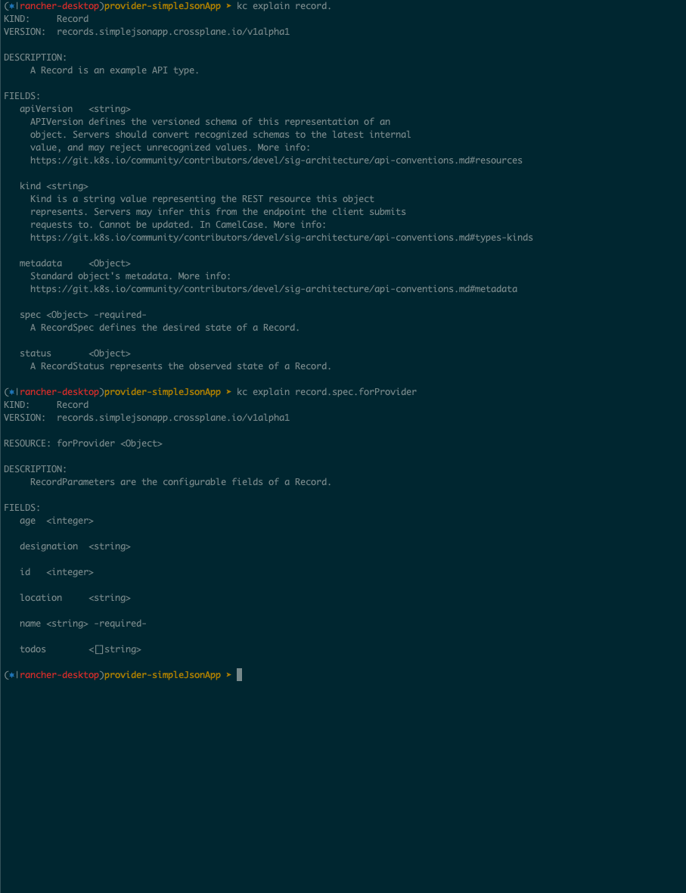
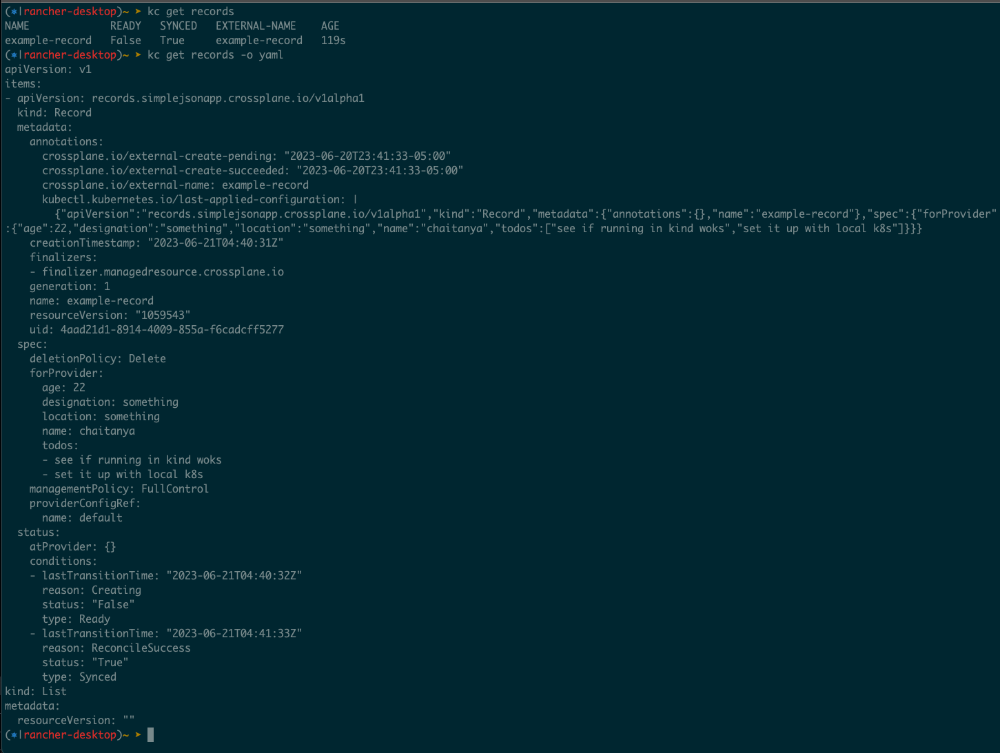
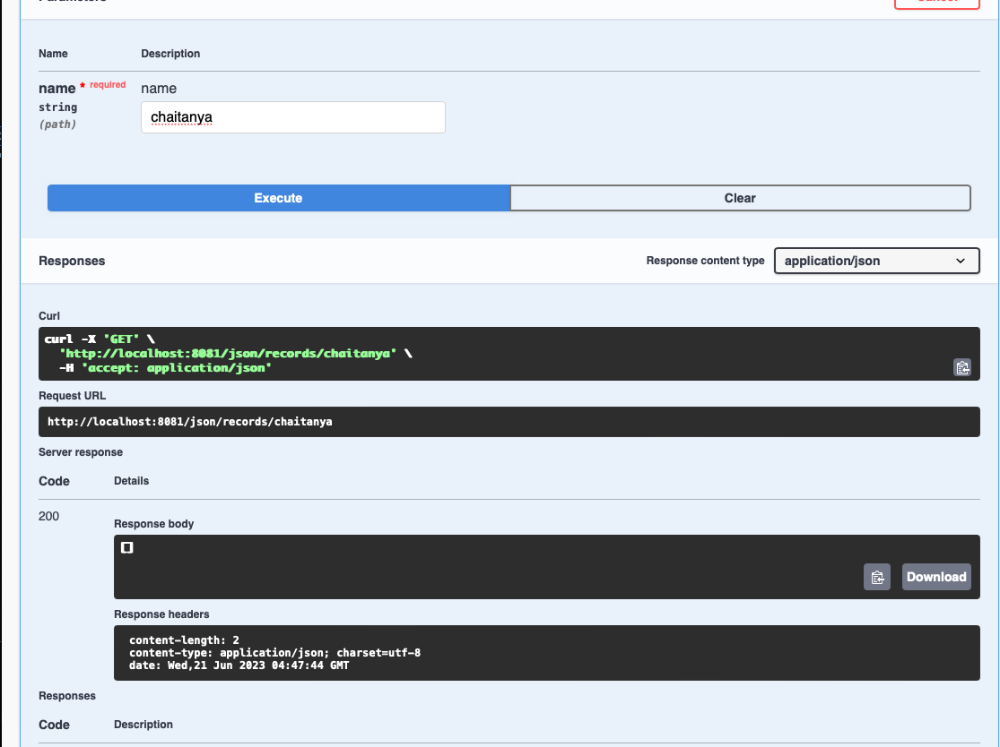

# provider-simplejsonapp

`provider-simplejsonapp` is a minimal [Crossplane](https://crossplane.io/) Provider,
using which one can express external json records as a k8s `record` resource.
This creates json records in an external application called [simple json app](https://gitlab.com/heb-engineering/teams/platform-engineering/gke-hybrid-cloud/kon/crossplane/simplejsonapp/simplejsonapp). Below installation process helps with setting up the api server and Crossplane, along with this provider locally.

# Installation

## Simple json app api server

- Clone [simple json app](https://gitlab.com/heb-engineering/teams/platform-engineering/gke-hybrid-cloud/kon/crossplane/simplejsonapp/simplejsonapp) locally and run

```
$ go run main.go
```

to install dependencies and run the app locally on port 8081. Refer to it's README.md for more details on how to authenticate to the app and make requests to it.

## Provider

- Install Crossplane:

  ```
  $ kc  apply -k https://github.com/crossplane/crossplane//cluster\?ref\=master
  ```

  You can also install it using helm as explained [here.](https://docs.crossplane.io/latest/software/install/)

- Create a secret with simple json app's jwt token like so:

  ```
  $ kubectl create secret generic simplejsonapp-secret --from-literal=token=<jwt token from simple json app's swagger ui here>
  ```

- Install Simple json app CRDs for Record Managed Resource and other ProviderConfig CRDs:

  ```
  $ kubectl apply -f package/crds
  ```

- Next, with your kube context pointing to cluster, or where ever you wish to install Crossplane and the provider, run:

  ```
  $ kubectl apply -f package/testYml/provider-simplejsonapp.yml
  ```

  which installs Provider `provider-simplejsonapp` and ProviderConfig `provider-simplejsonapp-config` (which references the secret we created in the previous step)

## Create and manage records

With Crossplane, Provider, ProviderConfig all installed we can now create `records` and manage them using Crossplane's Control plane.

Image showing the newly available `Record` managed resource



Run this command to create a record MR:

```

$ kubctl apply -f package/testYml/record.yml

```

This file contains spec for the record Managed Resource. Details on some fields added below:

```

apiVersion: records.simplejsonapp.crossplane.io/v1alpha1
kind: Record
metadata:
name: example-record
namespace: default
spec:
providerConfigRef:
name: provider-simplejsonapp-config ## Every MR can point to the Provider Config its Provider could use to authenticate to the external system
forProvider: ## contains object with details on record properties
name: chaitanyaSomething
age: 22
location: something
designation: something
todos: - see if running in kind woks - set it up with local k8s - causing an update - testing provider image setup

```

Once you apply record.yml file, you can then see the record created as part of k8s api (Managed resource) and can also verify
record being created from simple json app's swagger page (external system)

### Record creation:



### Record deletion:




## Defining Compositions, Composite Resources, Composite Resource Deifnitions and Claims:

With the previous steps, we have a `Managed Resource` that's now available to us as a resource from the k8s api, and we have
some new resources available to us (from installing Crossplane):

```

compositeresourcedefinitions xrd,xrds apiextensions.crossplane.io/v1 false CompositeResourceDefinition
compositionrevisions comprev apiextensions.crossplane.io/v1 false CompositionRevision
compositions comp apiextensions.crossplane.io/v1 false Composition
environmentconfigs envcfg apiextensions.crossplane.io/v1alpha1 false EnvironmentConfig
configurationrevisions pkg.crossplane.io/v1 false ConfigurationRevision
configurations pkg.crossplane.io/v1 false Configuration
controllerconfigs pkg.crossplane.io/v1alpha1 false ControllerConfig
locks pkg.crossplane.io/v1beta1 false Lock
providerrevisions pkg.crossplane.io/v1 false ProviderRevision
providers pkg.crossplane.io/v1 false Provider
storeconfigs secrets.crossplane.io/v1alpha1 false StoreConfig

```

Out of them, we will be setting up a `Composition` and a `Composite Resource Definition(XRD)` to setup a composite set of managed resources. This will be made
available to app teams as a `Composite Resource Claim`, created from a `XRD`. A `Claim` when applied against the k8s api creates a `Composite Reosource (XR)` and details on which resources make up the `XR` come from the `Composition`.

So essentially, we create the blueprint for all the resources that compose up to make a `Composite Resource(XR)` using our `Composition` and define a `XRD` which creates a `Claim`
that can be used to create `XR` in an application namespace, and therefore all the resources composed by the `XR`.

More details on the relationship of the resources and other terminology [here](https://docs.crossplane.io/latest/concepts/terminology/)

### Install

Install [provider-kubernetes](https://github.com/crossplane-contrib/provider-kubernetes) using below command

```

$ kubectl apply -f package/testYml/provider-kubernetes.yml

```

which creates k8s provider as seen below:

```

➤ kc get providers
NAME INSTALLED HEALTHY PACKAGE AGE
provider-simplejsonapp provider-simplejsonapp:v1 71m
provider-kubernetes crossplane/provider-kubernetes:main 5s

```

### Apply Composition

### Apply Composite Resource Definition

### Apply Claim

### Verify if XRs and its Managed Resources are created

```

```
