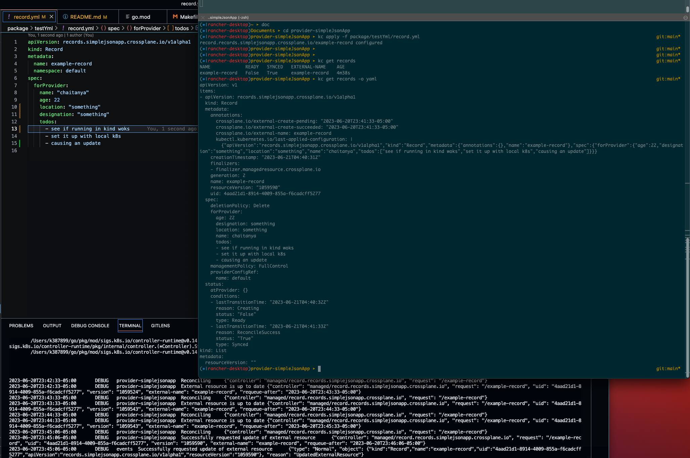
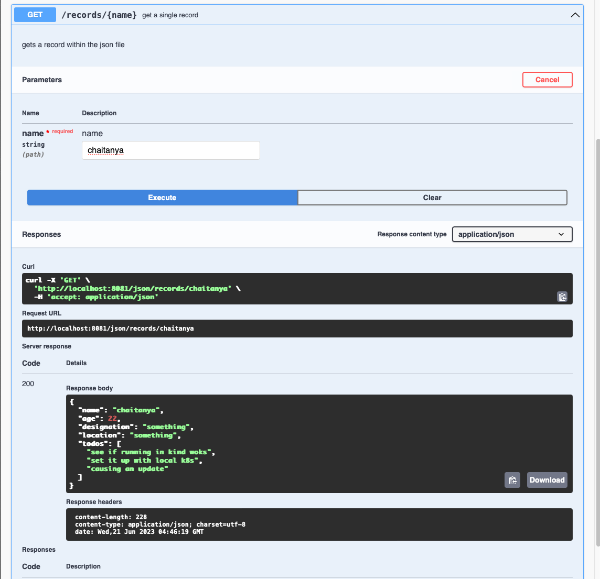

# provider-simplejsonapp

`provider-simplejsonapp` is a minimal [Crossplane](https://crossplane.io/) Provider
that is meant to be used as a simplejsonapp for implementing new Providers. It comes
with the following features that are meant to be refactored:

- A `ProviderConfig` type that only points to a credentials `Secret`.
- A `MyType` resource type that serves as an example managed resource.
- A managed resource controller that reconciles `MyType` objects and simply
  prints their configuration in its `Observe` method.

## Developing

1. Use this repository as a simplejsonapp to create a new one.
1. Run `make submodules` to initialize the "build" Make submodule we use for CI/CD.
1. Rename the provider by running the follwing command:

```
  make provider.prepare provider={PascalProviderName}
```

4. Add your new type by running the following command:

```
make provider.addtype provider={PascalProviderName} group={group} kind={type}
```

5. Replace the _sample_ group with your new group in apis/{provider}.go
6. Replace the _mytype_ type with your new type in internal/controller/{provider}.go
7. Replace the default controller and ProviderConfig implementations with your own
8. Run `make reviewable` to run code generation, linters, and tests.
9. Run `make build` to build the provider.

Refer to Crossplane's [CONTRIBUTING.md] file for more information on how the
Crossplane community prefers to work. The [Provider Development][provider-dev]
guide may also be of use.

[CONTRIBUTING.md]: https://github.com/crossplane/crossplane/blob/master/CONTRIBUTING.md
[provider-dev]: https://github.com/crossplane/crossplane/blob/master/contributing/guide-provider-development.md

## Local testing

Below images show Crossplane installed on a local cluster and provider-simplejsonapp running against it and resource managed by APIs exposed by [SimpleJsonApp](https://github.com/chaitanyakolluru/go-works/tree/main/simpleJsonApp) managed using k8s api.

// to add documentation on spec


By taking this Record spec and applying it:

```apiVersion: records.simplejsonapp.crossplane.io/v1alpha1
kind: Record
metadata:
  name: example-record
  namespace: default
spec:
  forProvider:
    name: "chaitanya"
    age: 22
    location: "something"
    designation: "something"
    todos:
      - "see if running in kind woks"
      - set it up with local k8s
```

### Record creation:


### Record updation:





### Record deletion:


### Provider Authentication:

`providerconfig/default` is used to configure our `provider-simplejsonapp`. ProviderConfig has references to `secret/simplejsonapp` which contains the auth token used to authenticate to the api server `simpleJsonApp`.

```
➤ kc get secrets/simplejsonapp-secret
NAME                   TYPE     DATA   AGE
simplejsonapp-secret   Opaque   1      10m

➤ kc get providerconfig/default
NAME      AGE
default   2d

➤ kc get providerconfig/default -o yaml
apiVersion: simplejsonapp.crossplane.io/v1alpha1
kind: ProviderConfig
metadata:
  annotations:
    kubectl.kubernetes.io/last-applied-configuration: |
      {"apiVersion":"simplejsonapp.crossplane.io/v1alpha1","kind":"ProviderConfig","metadata":{"annotations":{},"name":"default"},"spec":{"credentials":{"secretRef":{"key":"token","name":"simplejsonapp-secret","namespace":"default"},"source":"Secret"}}}
  creationTimestamp: "2023-06-21T03:11:29Z"
  finalizers:
  - in-use.crossplane.io
  generation: 2
  name: default
  resourceVersion: "1103646"
  uid: db8fd032-5a42-4e10-8813-bf85c5663294
spec:
  credentials:
    secretRef:
      key: token
      name: simplejsonapp-secret
      namespace: default
    source: Secret
status: {}
```
